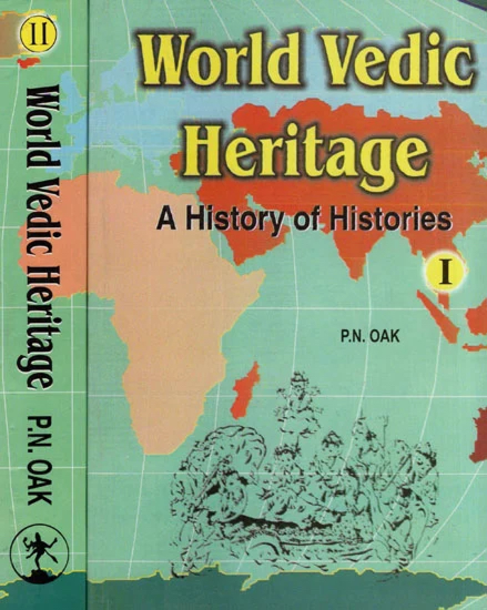

# World Vedic Heritage

## इतिहास

World Vedic Heritage   
A History Of Histories  
(Volume 1) 

Presenting A Unique Unified Field Theory Of History  
That From The Bechnning Of Time The World  
Practised Vedic Culture And  
Spoke Sanskrit  

P. N. OAK  
Founder President  
Institute For Rewriting World History  

## Copyright

World Vedic Heritage

© Purushottam Nagesh Oak 

## Dedication 

All mundane activity is a co-operative effort; so is this work which is hereby dedicated to my family members, relations, friends and the printers who helped in various ways in the completion of this project.

The object in writing this work is to acquaint and awaken the world public to its primordial Vedic Heritage of the times when human beings were not divided and packed into mutually hating, hissing and hitting national and religious compartments.  

Vedic culture regards the whole globe as a commom home and all beings (including animal and plant life) as one family. 

Hinduism is a modem residual, territorial synonym of primeval, ancient worldwide Vedic culture implying people residing in the Sindhu (pronounced Hindu) region, whose goal is to lead a virtuous life of renunciation and social service sans drugs, hot drinks and womanizing without being 
pinned down to any prophet or the prophet’s book.

Readers believing in such an ideal may help set up World Vedic Heritage Academies throughout the world. This work is also dedicated to that goal of freeing humanity from all forms of terror, torture, tyranny,treachery, trickery, taxation and temptation of so called religions and weld 
all people into a common harmonious, homogeneous, peaceful, cheerful, helpful fraternity.  

P.N. Oak   
  
Plot No . 10, Goodwill Society,   
Aundh, Pune - 411007, India   
Tel-( 0212 ) 338449 

## Table of Contents

5. The Unified Field Theory of History

## 5. The Unified Field Theory of History

This volume should rank as very unique in the entire range 
of world historical literature, because, so far as we can see, in 
modem times no one has presented a consistent, plausible, 
continuous, single-source account of world history. Each one has 
begun at some random point, discussed some chosen periods and 
topics of history and called it a day. 

Such treatment is symptomatic of the confusion that abounds 
in the minds of the intelligentsia regarding history. That confusion 
is multilateral. This volume is intended to remove that confusing 
haze from the reader’s mind and open before him a new vista 
of logical, systematic and thorough thinking in history. 

Theologians agree that despite diverse manifestations the 
immanent divinity is one. Likewise physicists agree that the seemingly 
diverse elements of the physical world emanate from a single source. 
That indicates that there is a certain common starting point for 
everything. Naturally history is no exception. History too had a 
single-source, one point beginning. That is to say the beginning 
of the cosmos and the start of humanity was not a random, freakish, 
spontaneous, wild growth of just anything, anytime, anywhere, 
anyhow. It was a planned and systematic beginning. This is what 
we call the Unified Field Theory of History. Consequently we believe 
that in modem times this volume is the first work to propound 
such a view. 

The world began millions of years ago with the Kruta Yuga 
(i.e. the ‘ready-made' era) with a complete, ready-made setting 
of human beings, plants and animals, with humanity rooted in 
Vedic culture and speaking Sanskrit. Thereafter, divinity kept 
aloof watching and umpiring the affairs of the world, even as people 
start a stage play or a field game, factory or business firm with 
fully-trained participants and thereafter keep away watching and 
umpiring the performance. 

All history must start from that metaphysical point. The present 
concept that man was born somewhere, somehow and that he 
developed one or more languages anyhow must no longer be regarded 
as rational. 

That single-source unity of humanity continued through three 
eras namely Kruta, Treta and Dwapar. Towards the end of the 
Dwapar Yuga came the nuclear and biological devastation of the 
Mahabharat war. 

The shattering effect of that unprecedented annihilation caused 
three main types of fragmentation. Administratively, the unitary 
world government was broken into regional states such as Syria, 
Assyria, Scythia, Babylonia, Egypt, India and China. Contrarily 
current historical texts assume that man evolved from a monkey 
he then developed a language and later he organized states like 
Babylonia and Syria. 

Theologically the Vedic pantheon was shared by breakway cults 
and creeds, with each swearing allegiance to some particular form 
of divinity. 

Linguistically, the teaching of Sanskrit throughout the world, 
having broken down, local mannerisms and corruptions of the 
ancient, primordial Sanskrit gave rise to various regional languages 
of Europe, Asia and Africa. That was how ancient Vedic unity broke 
up into the present cleavage in every sphere. 

Likewise the teaching of all Vedic sciences and arts such as 
architecture and Ayurveda (the Vedic science of medicine) suffered 
a severe setback because while their texts remained Sanskrit, the 
ancient sway of Sanskrit as the universal language having come 
to an end, those who could read or teach ancient Sanskrit texts, 
dwindled progressively. 

It was that catastrophe which ushered a dark age over the 
human world. Humanity became divided into sectors and pockets 
with some groups remaining cut off in distant regions, sinking 
to a state of primitive living. It is those which we regard today 
as the forest tribes or the backward communities such as the Red 
Indians of America or the aborigines, Maories of Australia and New 
Zealand. Other pockets of humanity were in a slightly better state 
of civilization. Yet humanity as a whole totally lost its great scientific 
and technological advancement of the Mahabharat era and was pushed 
back almost to square one to make a fresh start. 

Eversince though the Western world has caught up once again 
with some remarkable technological advancement yet that is about 
all that can be said on the credit side. Even there the Westerners 
have totally failed to resuscitate and recapture the lofty principles 
and standards of economical and painless prophylactic proficiency 
of Ayurved and the immaculate grandeur of Vedic architecture. 
Even in other fields such as theological unity, social cohesion, political 
and administrative unity, eradication of poverty and crime, ensuring 
unimpeded access to all parts of the world, eliminating sectional, 
sectarian and religious strife, modem society rates veiy low. The 
propagation of factional religions like Buddhism, Christianity and 
Islam have driven wedges in human society and plunged it into 
social and theological confusion. The Vedic moorings have been 
lost. Humanity today is in the hapless position of being thrown 
overboard from a wrecked Vedic ship to fend for itself in a dark, 
stormy, shark-infested sea of divisive selfish interests with each 
individual or group trying to outdo, undo or kill the others. 

It is this story which this volume unfolds, of how a once united 
world is being progressively (or regressively!) riven into ever smaller 
fiercer and more enmical factions. 

It is hoped, incidentally, that this Unified Field Theory of World 
History would help unite humanity once again in Vedic culture, 
in the universal teaching and speaking of Sanskrit, abandonment 
of all religious and political labels and treating the whole globe 
as one realm where man may once again move freely as in ancient 
times sans passport and sans visa. This way tuition in history 
will cease to be a mere academic exercise and will have a certain 
overwhelming social utility and purpose. 

This volume should also serve as an encyclopaedia of lost history. 
Several truths long remaining hidden and unknown have been salvaged 
and presented herein for the enlightenment of the world. 

This volume also points out that a mere study of historical 
records is of no use and does not make one a historian if along 
with that study one does not have a mind keen to know the truth 
and one is not courageous enough to speak it out from house-tops 
in the teeth of fierce opposition from various pressure groups. 

Though the subject matter of this volume is history, unlike 
others the reader won’t meet here a mere rehash of old events 
but an absolutely new narration of lost and unknown history, a 
plausible explanation of garbled and half-understood concepts and 
a fresh new research methodology. 

The evidence presented in this volume should be regarded not 
as exhaustive but only as indicative of a vast new, virgin field 
of research. 

Thousands of new research volumes containing such information 
countrywise, regionwise and language-wise will have to be published. 

For this great task it would be proper to found a World Vedic 
Heritage University or Academy to conduct research and tuition 
in this primordial human heritage. 

## Picture Index

## Bibliography

1) A Grammar of the Pure and Mixed Indian Dialects, by Herasim 
Lebedoff. 
2) The Story of Indian Music and its Instruments by Ethel Rosenthal. 
3) The Celtic Druids, by Godfrey Higgins 
4) A Collection of Curious Discourses, by Thomas Heame. 
5) Wanderings of a Pilgrim in Search of the Picturesque, by Fanny 
Parks, Oxford University Press, London. 
6) Encyclopaedia of Ignorance, Pergamon. 
7) A Complete History of the Druids (see details on page 207) 
8) Rome and the Campagna by R. Burn. 
9) Journal of the Royal Asiatic Society, London 
10) India in Greece, by Edward Pococke 
11) Antiquities of India, by Rev. Thomas Maurice 
12) Clips from a German Workshop 
13) Origin of Indo-Europeans, by Picket 
14) Wisdom of the Ancient Indians, by A. Schlegel 
15) History of Literature, by A. Schlegel 
16) The Upanishads, by Schlegel 
17) Encyclopaedia Britannica 
18) An Introduction to Linguistic Science 
19) The Story of Languages, Landon 
20) The Alphabet, by David Dringer (Original Italian translated 
into English). Foreword by Sir Ellis Minns 
21) The teaching of the Vedas, by Rev. Morris Philip. 
22) Vishnu Puran 
23) Vedic Sampatti, by Pandit Raghunandan Shaima 
24) The Ramayan, by Sage Valmiki 
25) Shilpa Samhita (in Jain Library, Anhilpur, Gujerat) 
26) Vaisheshik by Kanaad (Canada) 
27) Siddhanta Shiromani 
28) Bhoj-Prabandh 
29) Gaya Chin tarn ani 
30) Bhagwat 
31) Anshubodhini, by Bharadwaj 
32) Shukra Neeti 
33) Ain-e-Akbari by Abul Fazal 
34) Sur les Deconverte des Anciens Attributes aux. Modeme, by 
Monsieur Dutens 
35) Origines by Sir William Drummond 
36) Vedic Mathematics by Shankaracharya 
37) Vedic Shulba-Sootras 
38) Vedic Magazine 
39) Indian Concrete Journal 
40) Bhrugu Shilpa Samhita 
41) Hindi Shilpashastra 
42) Brihad Vi man Shastra 
43) The Bermuda Triangle (Avon Books, New York, 1975) 
44) Annual Research Journal of 1981 A. D. of the Institute for 
Rewriting Indian History. 
45) Irrigation Works in India (Roorkee) 
46) Buchanan’s Journey from Madras... etc (IB, Vols.) 
47) Matsya Purana 
48) Agastya Samhita 
49) Agastyamat 
50) The Story of Astronomy, by Patrick Moore 
51) Murray’s Handbook to India and Ceylon 
52) Travels in Asia and Africa by Abraham Parsons (Longmans, 
London) 
53) Asiatic Researches 
54) Historian’s History of the World, by J. . Russeau 
55) Caesar’s Commentaries on the Gallic War 
56) Sanskrit and its kindred Literature - Studies in Comparative 
Mythology, by Laura Elizabeth Poor (Other details on page 232) 
57) The Theogony of the Hindus, by Count Biomstiema. 
58) The Origin of the Aryans, by Sr Issac Taylor 
59) Phoenician Origin of the Britons, Scots and Anglo-Saxons. 
60) Hie Teaching of the Vedas, by Father Philips 
61) Arab aur Hind ke Talukat, by Suleman Nadvi 
62) Huentsang’s Travelogue, translated by Samuel Beal 
63) Albiruni’s India, by Edward Sachau 
64) Matter, Myth and Spirit or Keltic and Hindu Links by Dorothea 
Chaplin (details on page 291) 
65) Annals and Antiquities of Rajasthan, by Col. James Tod 
66) Hie Mysteries of Mitra (translated from French) by Thomas 
J. Me Cormack (details on page 291) 
67) Oriental Religions (English translation of Franz Cumont’s French 
book titled Les Religions Orientales dans le Pagani su Romain 
(details on page 297) 
68) Treatise on a Syrian Goddess, by Lucian 
69) Benares the Sacred City of the Hindus by M. A. Sherring 
70) Bharat as Seen and KnOwn by Foreigners by Babasaheb 
Deshpandey (details on page 301) 
71) The Edinburgh Review 
72) Hindu, Life Line of India, by G. M. Jagtiani. 
73) History of Ancient Sanskrit Literature, by Maxmueller 
74) India, What it can Teach Us, by Maxmueller 
75) Rome in Colour, by F. C. Pavilo 
76) History of British India, by Thornton 
77) History of Indian Literature, Professor Weber 
78) Slpa Sansar Weekly 
79) Indian Architecture, its Psychology, Structure and History from 
the first Mohammedan Invasion to the Present Day by E. B. 
Havell 
80) Five Thousand Years of Art of India, by Mario Bussagli 
81) Harsha Charita Ek Sanskritik Adhyayan by Vasudev Sharan 
Agrawal 
82) Buddhist and Christian Gospels, by Albert G. Edmunds, the 
Yukwan Publishing House, Tokyo 
83) The Secret Doctrines of Jesus, by H. Spencer Lewis, the Supreme 
Grand Lodge of AMORC, San Jose, California 
84) The Mystical Life of Jesus, by H. Spencer Lewis (Other detail 
same as above) 
85) The Chosen People, by John M. Allegro, Granada Publishing 
Ltd. Park Street, St. Albans, Herts, 1973. 
86) Marco Polo’s Travels, translated and edited by Sr Henry Yule. 
87) Great Australian Loneliness, by Miss Ernestine Hill. 
88) We Are Not the First; by Tom Andrews. 
89) Journal of the Indo-Japanese Association, January 1910 
90) National Geographic Magzaine, Washington D. C., December 
1990 issue. 
91) Cuatemoe, by Miss Cora Walker 
92) Hindu America, by Bhikshu Chamanlal, Bharatiya Vidya Bhawan 
Publication 1940 A. D. Bombay 
93) Primitive Traditional History, by Hewitt 
94) Ancient Society by Margau 
95) Ruling Races of Pre-Historic America 
96) Myths of Pre-Columbian America, by Mackenzie 
97) Sunday Standard (India), July 27, 1975. 
98) Worldwide Hindu Culture, Sanskrit and Unity in Diversity by 
Dr.S. Venugopalacharya 
99) Ideals of the East by Okakura 
100) Arya Tarangini (Two Volumes) by A. Kalyanraman, Asia 
Publishing House, Bombay 
101) Arminicus Vambery - His Life and Adventures, written by 
himself (details on page 606) 
102) Marathi MANOOS weekly, Pune, Sept.-Oct. 1980 issue. 
103) Collectania DeRebus Hibemicus, by Lt. Gen. Charles Vallancey, 
Printed by Oraisberry and Campbell, 10 Back Lane, Dublin 1804. 
104) The History of Hindustan, Its Arts and Its Sciences as connected 
with the History of Other great Empires (Reprinted by Navrang 
New Delhi 110012, India, in 1974). 
105) Historical Monuments of Isfahan, by Honoarfar, Director 
Teheran University 7th edition. 
106) A Dictionary of Islam, by Thomas Patrick Hughes, Oriental 
Publishers, 1488 Pataudi House, Delhi. 
107) Herodotus, Rawlinson’s translation, revised and annotated by 
A. W. Laurence, the Nonesuch Press, Great James Street, 
Bloomsbury. 
108) Fodor’s Guide to Iran, edited by Richard Moor, published 
by Hodder and Stoughton, London 1979. 
109) Origins or Remarks on the Origin of Several Empires, States 
and Cities by the Rt. Honable Sir W. Drummond, Printed 
by A. J. Velpy, Red Lion Court, Fleet Street, sold by Baldwin 
& Co. 1826. 
110) The Theosophist, March 1881, Adyar, Madras, India. 
111) Egyptian Myth and Legend 
112) Long Missing Links, by Aiyangar, Theosophies! Library, Adyar, 
Madras, India. 
113) Remains of Lost Empires, by P. V. N. Myres (Harper and 
Bros. Publishers, New York, 1876) 
114) The Indian Antiquary, Volume of 1878 A. D. 
116) The Cosmos and its Mathematical Study, by 
Mohammad - al - Tu si, in the Egyptian National Library Cairo. 
116) India's Contribution to World Thought and Culture, publshed 
by the Vivekanand Rock Memorial Committee, 1970. 
117) The Koran, by N. J. Dawood, Penguin Classics, 4th edition 1974. 
118) The Background of Islam, by H. Stf. B. Philby, publishers M/S. Whitehead Morris, Alexandria, Egypt 1946. 
119) Mecca the Sacred and Medina the Radiant, by Emil Esin. 
120) Islam, by Alfred Guillaume, Penguine Books Ltd. Hammonds 
Worth, Middlesex, U. K. 1964. 
121) With the Pilgrims toMecca, by Hadji Khan and Wilfred Sparrow, 1902. 
122) With Lawrence of Arabia, by Lowell Thomas 
123) Memoirs of India, by R. G. Wallace, Published in 1824 A. 
D. 
124) Letters on India, by Maria Graham, Longmans, London 1814 
A. D. 
125) Travels in Arabia, by John Lewis Burckhardt (Henry Colburn, 
London, 1829). 
126) Illustrated Weekly of India, December 30, 1979, Bombay. 
127) Holy Bible, edited by the American Review Committee. 
128) Namaz : The Yoga of Islam, by Ashraf F. Nizami, Nizami 
Compound, Pratapnagar Road, Baroda. 
129) Harihareswar Mahatmya 
130) Astronomical Alignments in Mediaeval Islamic Architecture, 
Research paper by David A. King, Hagop Kevorkian Centre 
for Near, Eastern Studies, New York. 
131) Sultan Mahmud of Ghaznin, by Professor Mohamad Habib 
of Aligarh Muslim University, Aligarh, India. 
132) The History of Mankind, UNESCO publication. 
133) Organiser Weekly (May 9, 1993) 29 Rani Jhansi Road, New 
Delhi 110055. 
134) The Hindu, English daily, Madras, India (July 30 to August 
5, 1940) 
135) Strabo’s Geography 
136) A Voyage to the East Indies, by Fra Paolin Da Tan Bartolomeo 
137) The Last Two-Million Years, Readers Digest History of Man, 
published by the Readers Digest Association, London 1974. 
138) The Evening News of India, Bombay 30th August 1982. 
139) London Times of October 12, 1978. 
140) National Geographic Magazine, March 1980 
141) The Tibetan Dictionary 
142) Narrative of a Journey Overland from England to India, by 
Mrs. Col. Elwood, two volumes, Henry Colburn, London, 130. 
143) India and the English, by Barbara Wingfield-Stratford, Jonathan 
Cape, London 1922 A. D. 
144) Discourse on Sanskrit and its Literature, by Professor Bournouf. 
145) L’Etemite des Emperaurs Romans, 1896. 
146) British Discovery of Hinduism, a collection of essays by a 
number of British scholars. 
147) Myths of Pre-Columbus America by Mckenzie. 
148) The East and West Magazine, Italy, Vols. 4 & 18. 
149) A B C of Christianity, by Joseph Bernard. 
150) History of Rome, by Smith. 
151) The Commentarius of Caesar (English translation, London). 
152) Holy Blood and the Holy Grail, by Michael Baigent, Richard 
Leigh and Henry Lincoln. 
153) Shakespeare - A Documentary of His Life, by Schoenbaum. 
154) Oxford Dictionary of Place Names and Proper Names. 
155) Fowlers’ Howlers, author, publisher P. N. Oak, Pit. No. 10, 
Goodwill Society,Aundh, Pune, 41107, India. 
156) The Origin of Observatories in India, research paper by prof essor 
K. D. Mathur, USA, read at a conference in Scotland (10 
to 19 August 1977), the Edinburgh Review, Vol. 10, P.387. 
157) Observation on a Gold Ring found at Montrose in Scotland, 
on May 13, 1830, research paper read by Lt. Col. James 
Tod. 
158) Transactions of the Royal Asiatic Society of Great Britain, 
pp. 559-571, Vol. H, Article XXVI. 
159) India 3000 Years Ago, by Dr. John Wilson, (first published 
in 1858, later reprinted by the Indological Book House, 
Varanasi) 
160) Book of the Dun Cow, an old Gaelic manuscript. 
161) Encyclopaedia of Ireland, Allen Figgis, Dublin 1968. 
162) Itihas Patrika (research journal), published by Dr. V.V. 
Bedekar, Bedekar Hospital, Maharshi Karve Road, Thana 
400601, India. 
163) Journal of the Discovery of the Source of the Nile, by Col. 
John Speke. 
164) Ancient History of the Near East, By H. R. Hall. 
165) Letter to Editor, National Herald (Delhi) April 28, 1992, by 
Upendra Fotedar, 1925-20E Eastchester Road, Bronx, N. Y. 
USA. 
166) Myths of Pre-Columbian America, by Mackenzie 
167) History of East Africa, by March and Kingsworth. 
168) Journal of the Polynesian Society, Vol. 13 of 1904 and Vol. 
26 of 1917. 
169) The Ancient History of Maori, by White 
170) The Aryan Maori (Published in 1885) by Treager. 
171) Description of an Ancient City of Mexico, by Felix Cabrara 
Published by Berthoud, 65 Regent’s Quadrant 
172) Holy Bible, printed by the Cambridge University Press. 
173) The Plain Truth About Christmas, published by the Worldwide 
Church of God Organization, P.O. Box 6727, .Bombay 400032, 
India. 
174) The New Schaff Herzog Encyclopaedia of Religious Knowledge. 
176) Journal AWAKE (December 22, 1981) published by Jehova's 
Witnesses. 
176) The Great Evolution Mystery, by Gordon Rattray Taylor 
(Seeker, 278 pp.) 
177) Mythes et Epopee', by L. DumozO 
178) Gospels of Henry the lion (Compiled around 1174 A. D.) 
by Harimann, a Benedictine monk at the German abbey of 
Helmarshausen near Brunswick, in Lower Saxony, Germany. 
179) Spot on the Mutiny, by Keay. 
180) Indian Archaeology, by James Fergusson. 
181) Archaeological Survey of India Report for 1871-72. 
182) Carlleyle’s noting in the 1899 Annual Report of the North 
West Provincial Circle of the Archaeological Survey of India. 
183) The First two Nawabs of Oudh, by Dr. Ashirbadilal Srivastava. 
184) Carlleyle's Report on Agra (Pages 124-125, Volume of 1871-72 
A. D.) 
186) Taj Mahal - Simple Analysis of a Great Deception, by V. 
S. Godbole. 
186) History of Indian and Eastern Architecture, by James 
Fergusson. 
187) The World of Ancient India, by G. Le Bon (Original French 
book. Its English version has been published in USA by the 
Tudor Publishing Col. of New York in 1974) 
188) Paper No. 2, Papers Relating to East India Affairs, House 
of Commons, London, June 3, 1813. 
189) Encyclopaedia Americana 
190) The New Catholic Encyclopaedia. 
191) The Story of Civilization, by William Durant. 
192) Life of Jesus, by Ernest Revan. 
193) Antiquities, by Josephus 
191) The Dictionaiy of Mythology, Folklores and Symbols, by 
Gertrude Jobes. 
195) Washington Post, October 11, 1964. 
196) Journal of a Residence in India, by Maria Graham, published 
by Archibald Constable & Co. Edinburgh, 1812. 
197) A Brief History of Indian Peoples, by Sir W. W. Hunter. 
198) Earthstars, by C. E. Street, Hermitage Publishing, P. 0. 
Box 1383, London. 
199) Chariot of the Gods, by Eric Von Daniken 
200) The Geometry of London's and Great Britain's Ancient Vedic 
Shrines 
201) Britannica World Language. 
202) Early History of India, by Vincent Smith (1908) 
203) The Embassy of Sir Thomas Roe in India 1615 to 1619, edited 
by W. Foster, London, 1926 A. D. 
204) The Religious and Philosophical System of the Hindus, by 
H. H. Wflson. 
205) The Growth of Civilization by Dr. W. H. Perry 
206) The History of East Africa by Marsh and Kingsworth. 

## Index of Personal Names
## Appendix 1
## Appendix 2
## About the Author

P.N. OAK   
  
Born af 9.54 am. On March 2. 1917 in Indore (Central India).

The author, P.N. Oak having made some far-reaching discoveries in
history, is the founder president of the Institute for Rewriting World
History. His latest finding is that in pre-Christian times Vedic culture
and Sanskrit language held full sway throughout the world.

P.N Oak was bom in a Maharashtrian Brahmin family in which his father
talked to him only in Sanskrit, mother only in English, relations in
Marathi and town- folk in Hindi. That gave him fluency in those four
languages from childhood.

After obtaining his B.A. degree from Agra University and completing
M.A., LL. B, courses of the Bombay University, Oak worked for a year as
Tutor in English at the Fergusson College, Pune and later having joined
the army was posted to Singapore at the age of 24.

There, after British surrender, Oak was one of the organizers of the
Indian National Army, a director and commentator at the Free India
Radio, Saigon, and latter a co-worker of Netaji Subhash Chandra Bose.

After the end of World War II, Oak hitch-hiked from Singapore to
Calcutta across the border jungles of several countries.

From 1947 to 1974 his profession has been mainly journalism having
worked on the editorial staffs of the Hindustan Times and the Statesman,
as a class I Officer in Ministry of Information and Broadcasting,
Government of India, and as editor in the American Embassy’s information
service, all in New Delhi.

Around 1959, Oak developed a curious new insight into history which led
him to some stunning discoveries as a result of his absorbing hobby of
visiting historic sites. He then founded (June 14, 1964) the institute
for Rewriting Indian History and wrote several books (listed elsewhere
in this volume).

Oak’s historical acumen led him to discover further that even world
history has gone wrong. His discoveries havetherefore, outgrown the name
and scope of the Institute for Rewriting Indian History. Having
discovered that from time immemorial up to the Mahabharat War, Vedic
culture and Sanskrit pervaded the whole world.

Oak is keen to found a world Vedic Heritage University to educate the
world in the primordial Vedic unity of all humanity. To that end he
invites correspondence from all those willing to help.

