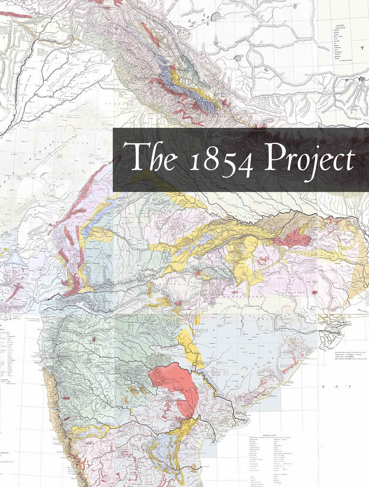

# The 1854 Project

## इकलियुग

The 1854 Project

(the age of darkness) 

by 

Kardama Devahuti 

ॐ असतो मा सद्गमय । 
तमसो मा ज्योतिर्गमय । 
मृत्योर्माऽमृतं गमय ॥ 
ॐ शान्तिः शान्तिः शान्तिः ॥  

## Copyright

Copyright © 2023 Kardama Devahuti

All rights reserved.

No part of this publication may be reproduced, stored in a retrieval
system, stored in a database and / or published in any form or by any
means, electronic, mechanical, photocopying, recording or otherwise,
without the prior written permission of the publisher.

Published in  કલા નગરી, *kalā nagarī*: "city of art" by મન, *man*: "mind"[^1]

Cataloging in Publication Data

Name: Kardama Devahuti, 2023— author. 
Title: The Vedic context of religions of man/ Kardama Devahuti 
ASIN: 
Subjects: 1. Sociology 2. Epistemology

## Contents

Author’s Note  
A Note About This Book  
Epigraph  
Preface  

1. Aryan
2. Caste
3. Sati
4. Swastika
5. Hindutva

Dedication  
Acknowledgements  
Contributors  
Notes  
Credits  
   
## Author's Note

Preceding each chapter is a transcription of the word in question the original script,  followed by a transliteration of the Word in ISO Latin 1 in italics, followed and a brief definition (translation) of the Word in English in parentheses.

## A Note About This Book

> The word "dogma" comes from the Greek dok (ein) which may be translated as "seem good."
> Equality, justice, freedom, democracy, all of these are dogmas for us today, just as
> the Godhead, the Resurrection, and spiritual grace were (and still are)
> dogmas for the christan community (Nisbet 22-23).

## Epigraph 

असतो मा सद्गमय । 
तमसो मा ज्योतिर्गमय । 
मृत्योर्माऽमृतं गमय ॥ 
 
*asato mā sadgamaya,* 
*tamaso mā jyotirgamaya,* 
*mṛtyormā'mṛtaṃ gamaya.* 
 
From the unreal lead me to the real! 
From the darkness lead me to the light! 
From death lead me to immortality! 

## Preface 	

>Truth is a thing of this world: it is produced only by virtue of multiple
>forms of constraint.  And it induces regular effects of power.  Each society
>has its regime of truth, its “general politics” of truth: that is, the types
>of discourse which it accepts and makes function as true; the mechanisms and
>instances which enable one to distinguish true and false statements, the means
>by which each is sanctioned; the techniques and procedures accorded value in
>the acquisition of truth; the status of those who are charged with saying
>what counts as true (Foucault, *The Foucault reader* 72-73).

## Dedication 

Indians—Past, Present and Future

## Acknowledgements

The 1619 Project

## Contributors 

**Kardama Devahuti** is a staff writer at *The Institute for ReWriting World History*. 

## Notes 

  Nisbet, R.A. *The Degradation of the Academic Dogma: The 
    University in America, 1945-1970*. Pearson Education, 1971.

  Foucault, Michel. The Foucault reader. United Kingdom, 
    Knopf Doubleday Publishing Group, 1984.

  Belsare, Malhar Bhikaji. *ગુજરાતી-અંગ્રેજી ડિકશનરી [Etymological
    Gujarati-English Dictionary].* 2nd Edition, Asian Educational
    Services, 2002.
    
[^1]: તન-મન-ધન a. n. [See તન + મન + ધન] Lit. The body, the mind, and
    one’s wealth. Hence, 2. All that one loves; the highest object of
    one’s ambition (Belsare 577).

    Belsare, Malhar Bhikaji. *ગુજરાતી-અંગ્રેજી ડિકશનરી [Etymological
    Gujarati-English Dictionary].* 2nd Edition, Asian Educational
    Services, 2002.
    
## Credits 

1. Greenough, George Bellas, *General sketch of the physical and geological features of British India*, 1855.
